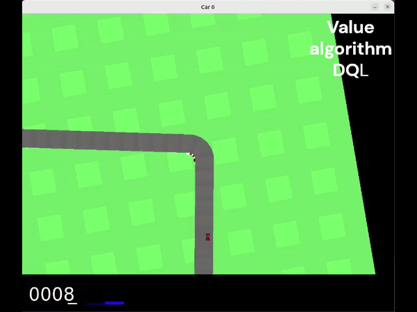
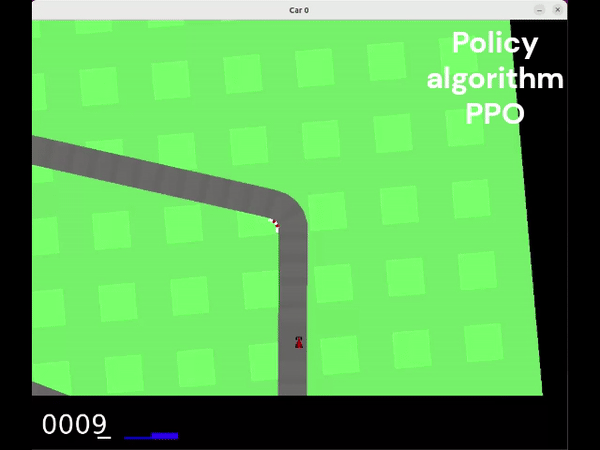
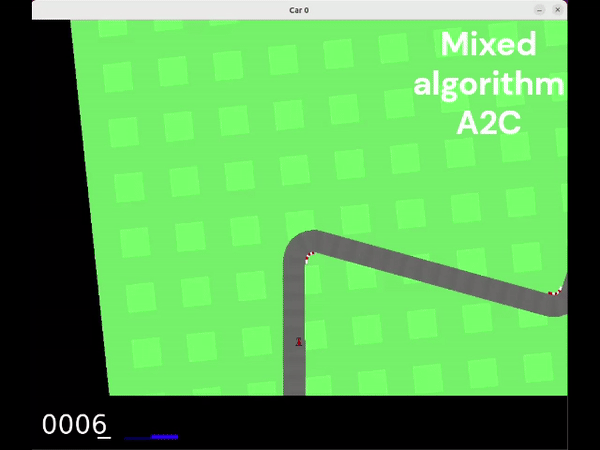
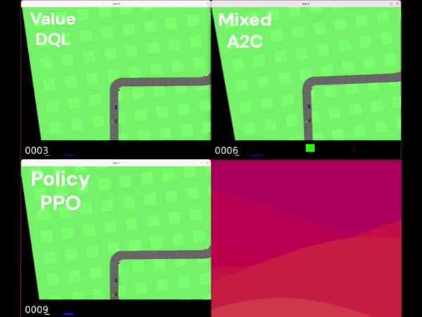
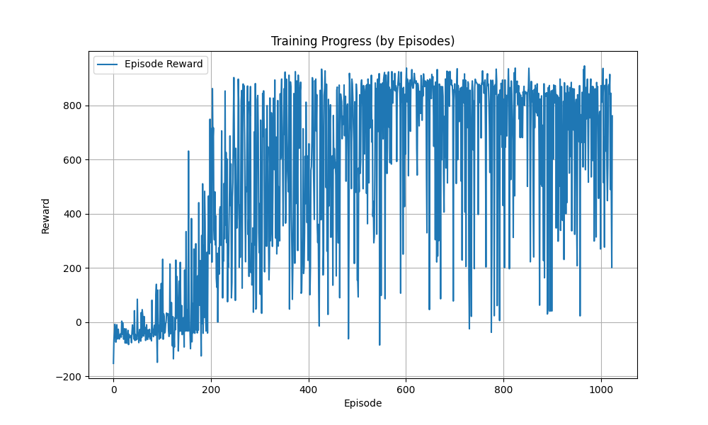

# RL AI Project: Comparison of Boosting Algorithms

<div>
  
  
</div>

## Introduction
This project aims to study and compare different Reinforcement Learning (RL) algorithms, exploring their characteristics and behaviors. We implemented three types of algorithms:

- **Deep Q-Learning (Value)**.
- Proximal Policy Optimization (Policy) **Advantage Actor-Critical (Policy)**.
- Advanced Actor-Critic (Mixed) **Advantage Actor-Critic (Mixed)**.

Finally, the trained models compete in a multi-agent race environment to evaluate their performance.

---

## Simulations

### Deep Q-Learning


### Proximal Policy Optimization


### Advantage Actor-Critic


### Multiagent race

---

## Project Structure
```
├── A2C/ # # Folder for the A2C algorithm 
├─── PPO/ # Folder for PPO algorithm 
├─── deepQ/ # Folder for the Deep Q-Learning algorithm. 
├─── gym_multi_car_racing/ # Modified MultiCarRacing library. 
├─── race/ # Scripts for racing with trained models. 
├─── videos/ # Contains gifs and videos of the simulations. 
├─── .gitignore # Files ignored by git. 
├─── enviroment.yml # Anaconda environment configuration. 
├─── setup.py # Library installation configuration.
```

---

## Important files per algorithm
Each algorithm folder includes the following files:

- **`train.py`**: Train the model.
- **`trainhuman.py`**: Train the model with graphical rendering (slower but viewable).
- **`replay.py`**: Loads a trained model and shows it playing.
- **`plot_results.py`**: Generates graphs of episodes vs. rewards to analyze learning.
- **`paralleltrain.py`**: Intensive training with multiple parallel environments.

---

## Execution

### Prerequisites
- Anaconda installed.
- CUDA-compatible GPU** (optional, but recommended to speed up training).

---

### Instructions

#### Clone the Repository

```git clone https://github.com/tu_usuario/multi-agent-car-racing-RL.git```
```cd multi-agent-car-racing-RL```

### Create the Anaconda Environment

```conda env create -f environment.yml```
```conda activate car```

### Install gym_multi_car_racing Library
```python -m pip install -e gym_multi_car_racing```

## Train a Model

Go to the folder of the algorithm you want to train, for example, PPO:
```cd PPO python train.py```

## View a Simulation
Once trained, you can load the model and watch it play:
```python replay.py```

## Perform a Multiagent Race
Run the race script in the `race` folder:
```cd race```
```python race.py```

## Results 

Example of Model Behavior
Here you can see how each algorithm performs in the environment:

1. Deep Q-Learning
2. Proximal Policy Optimization
3. Advantage Actor-Critic

---

## Multi-agent race
In the final race, the three models compete for the highest score. Here is the final ranking based on 10 races:

## Multi-agent race

In the final race, the three models compete for the highest score. Here is the final ranking based on 10 races:

| Model  | Won races        |
|--------|------------------|
| PPO    | 6                |
| A2C    | 3                |
| DQN    | 1                |

Each model uses a unique strategy derived from its RL algorithm, demonstrating how these different approaches perform in a competitive environment.

---

## Training Details

### Algorithm Configuration

- Deep Q-Learning (DQN)**: Uses a table of Q-values to decide the best action based on an observed state.
- Proximal Policy Optimization (PPO)**: Policy-based algorithm that directly optimizes the probability of taking an action as a function of a state.
- Advanced Actor-Critic (A2C)**: Combines a policy (actor) with a value function (critic) to improve stability and training efficiency.

### Strategies Used

- Parallel environments**: Multiple environments are used to optimize training time and improve the efficiency of the available hardware.
- Real-time visualization**: With `trainhuman.py`, you can observe the behavior of the model during training.
- Learning graphs**: With `plot_results.py`, you can analyze the efficiency and rewards obtained throughout the episodes.

---

## Training Graph Example

The rewards accumulated per episode allow visualizing whether the model is learning effectively and its convergence speed:



